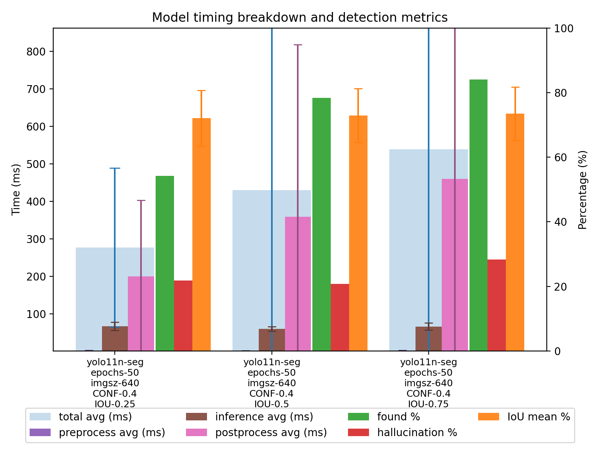

# YOLO Segmentation: Train → Benchmark → Plot

This repo provides a simple, reproducible pipeline to:

1) Train Ultralytics YOLO segmentation models
2) Benchmark trained models over a small image set, saving overlays and a per-image TSV
3) Plot timing breakdown and detection metrics per model


## Quick start (in order)

1) Train models (or skip if you already have `.pt` files)

```bash
python train_models.py
```

2) Benchmark models and write per-image results under `predictions/<model>/benchmark.csv` (tab-separated)

```bash
python benchmark_models.py
```

3) Plot results for selected prediction folders; saves `plot.png`

```bash
python plot_grades.py
```

The resulting figure is saved next to the script. Example:




## Environment

- Python 3.10+
- Install dependencies:

```bash
pip install -r requirements.txt
```

Ultralytics auto-downloads hub checkpoints (e.g., `yolo11n-seg.pt`) when referenced by name. Trained `.pt` files are written to `trained_models/` by the training script.


## 1) Training: `train_models.py`

Two modes are supported through `CONFIG["mode"]`:

- MULTI_MODELS: train several pretrained checkpoints with the same train params
- SINGLE_MODEL_MULTI_CFG: train one pretrained checkpoint across a set of variants

Key configuration (abridged):

```python
CONFIG = {
	"mode": "MULTI_MODELS" | "SINGLE_MODEL_MULTI_CFG",
	"models": {
		"multi_models": ["yolo11n-seg.pt", "yolo11s-seg.pt", ...],
		"single_model": "yolo11n-seg.pt",
	},
	"train": {
		"common": {"imgsz": 640, "epochs": 50, "batch": -1, "device": "cpu"},
		"variants": [{"epochs": 35}, {"epochs": 50}, ...],
	},
	"data": {"yaml": "containers_dataset/data.yaml"},
	"output": {"dir": "trained_models"},
}
```

Outputs: for each run the best checkpoint is copied to `trained_models/` with the pattern:

```
<model_stem>_epochs-<E>_imgsz-<S>.pt
```

Notes:
- Set `device` to `"0"` (or similar) to use GPU.
- Using a hub name like `yolo11n-seg.pt` will auto-download it on first use; no manual download required.


## 2) Benchmarking: `benchmark_models.py`

This script runs inference on each image in your benchmark set several times, writes a single tab-separated row per image (mean timings over repeats; detection metrics from the first repeat), and saves an overlay image (from the first repeat only).

Modes via `CONFIG["mode"]`:

- MULTI_MODELS: evaluate multiple `.pt` files from `models_dir`
- SINGLE_MODEL_MULTI_CFG: evaluate one `.pt` file across a list of predict-time variants

Key configuration (abridged):

```python
CONFIG = {
	"mode": "SINGLE_MODEL_MULTI_CFG",  # or "MULTI_MODELS"
	"models": {
		# filenames relative to models_dir
		"multi_models": [
			"yolo11n-seg_epochs-50_imgsz-640.pt",
			"yolo11s-seg_epochs-50_imgsz-640.pt",
		],
		"single_model": "yolo11n-seg_epochs-50_imgsz-640.pt",
	},
	"models_dir": "trained_models",  # directory with your .pt files

	"predict_common": {
		"imgsz": 640, "conf": 0.25, "iou": 0.5,
		"device": "cpu", "retina_masks": True, "verbose": False,
	},
	"variants": [  # merged with predict_common when in SINGLE_MODEL_MULTI_CFG
		{"conf": 0.4, "iou": 0.25},
		{"conf": 0.4, "iou": 0.50},
		{"conf": 0.4, "iou": 0.75},
	],

	# Dataset folders
	"images_dir": "benchmark_images/containers_test",
	"images_subdir": "images",
	"labels_subdir": "labels",  # YOLO labels (.txt), supports optional hash prefixes

	"repeats": 5,                 # N repeats per image; timings are averaged
	"out_root": "predictions",   # where results are stored

	"eval": {"enabled": True, "iou_thr": 0.5, "match_by_class": False, "eval_mode": "masks"},
	"visual": {"alpha": 0.35, "thickness": 3},
}
```

Dataset expectations:
- Images under `<images_dir>/<images_subdir>`
- Labels under `<images_dir>/<labels_subdir>` using YOLO format (boxes or polygons)
- Label filenames may include a hash before the image stem (the script matches by stem containment)

Per-image TSV format (`predictions/<model>/benchmark.csv`, tab-separated):

```
image_id	total_ms	preprocess_ms	inference_ms	postprocess_ms	tp	fp	fn	mean_tp_iou_pct	std_tp_iou_pct
```

Notes:
- Only the first repeat computes TP/FP/FN and IoU; timings are averaged across repeats.
- Overlays are saved for the first repeat only. In `eval_mode="masks"`, translucent masks are drawn for TP/FP/FN.


## 3) Plotting: `plot_grades.py`

Reads `predictions/<model>/benchmark.csv` for the configured models and creates a grouped bar chart per model:

- Left block (ms):
  - Big bar: total avg with std errorbar
  - Three thin bars: preprocess, inference, postprocess (with std errorbars)
- Right block (%):
  - found% = TP/(TP+FN) × 100
  - hallucination% = FP/(TP+FP) × 100
  - IoU mean % with std errorbar (pooled across images, weighted by TP)

Key configuration in `plot_grades.py`:

```python
CONFIG = {
	"show_legend": True,
	"log_ms_axis": False,
	"paths": {"predictions_root": "predictions", "out_png": "plot.png"},
	"models": [
		"yolo11n-seg_epochs-50_imgsz-640_CONF-0.4_IOU-0.25",
		"yolo11n-seg_epochs-50_imgsz-640_CONF-0.4_IOU-0.5",
		"yolo11n-seg_epochs-50_imgsz-640_CONF-0.4_IOU-0.75",
	],
}
```

Tips:
- Ensure `models` matches the subfolder names created under `predictions/` by the benchmark script.
- The script auto-detects tab vs comma delimiter; TSV is preferred.


## FAQ

Q: Do I need to download `yolo11n-seg.pt` manually?

A: No. Ultralytics downloads hub checkpoints the first time you use them. If you prefer local files (or are offline), place `.pt` files in `trained_models/` and reference them via `CONFIG["models"][...]` along with `models_dir` in `benchmark_models.py`.

Q: CPU vs GPU?

A: Set `device` in both training and benchmarking configs. Use `"0"` (or `"0,1"`) to target GPUs, or `"cpu"` to stay on CPU.

Q: Boxes vs masks evaluation?

A: Choose via `CONFIG["eval"]["eval_mode"]` in `benchmark_models.py` (`"boxes"` or `"masks"`). Label polygons are supported when present; otherwise boxes are used.

